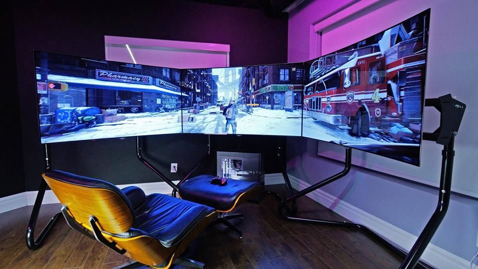

# Grupo 11 - Digital House

## Station Game 🎮

Somos STATION GAME,
Una tienda online que se especializa en venta de productos del mundo gamer.
La misma se divide en tres grandes categorías:
PLAYSTATION - XBOX - NINTENDO
Dependiendo por donde se quiera sumergir el usuario, STATION GAME brindará una experiencia personalizada basada en la elección.

Nuestro público apunta a los amantes de los videojuegos, el cuál piensa de ya sea un juego, consola o accesorio, como una pieza coleccionable de este mundo.

### Sitios de Referencia :
📄 https://www.gamestop.com/
Gamestop, en su raíz, posee la posibiidad de redireccionar según MARCA.(ya sea, Xbox, Playstation, Nintendo, entre otros) Dentro de STATION GAME, buscamos una lógica similar para navegar.

📄 https://www.xbox.com/en-US/
Nos referenciamos con la página oficial de XBOX para influenciarnos con su estética a la hora de diseñar la categoría dentro de nuestro proyecto.

📄 https://store.sony.com.ar/playstation
Nos referenciamos con la página oficial de SONY-PLAYSTATION para influenciarnos con su estética a la hora de diseñar la categoría dentro de nuestro proyecto.

📄 https://www.nintendo.com/es_AR/
Nos referenciamos con la página oficial de NINTENDO para influenciarnos con su estética a la hora de diseñar la categoría dentro de nuestro proyecto.

📄 https://www.mexx.com.ar/
Queremos basarnos en cómo muestra los productos desde la raíz, ya que muestra bastante información de una manera organizada.

📄 https://www.youtube.com/
Pensamos utilizar el mecanismo del menu desplegable de la izquierda(hamburger), en el cual por defecto muestra íconos referentes a las categorías, y al expandirlos muestra el detalle de los mismos.  

#### Integrantes 🧑‍💻 :

⚫ Joaquin Abal :   Tengo 23 años. Soy una persona tranquila con ganas de aprender a full .
             
⚫ Manuel Prozzi:   Tengo 29 años y soy muy poco creativo a la hora de escribir descripciones sobre mi mismo.        

⚫ Luciano Fabrizio Leguiza:  Tengo 25 años, estudiante de licenciatura en administracion, actualmente aprendiendo programación.

<h4 align="left">________________________________________________________________________________</h4>

<h4 align="left">HTML5 | CSS3 | JavaScript | ReactJs | NodeJs | Express | Git | Github |</h4>

</a> 
 